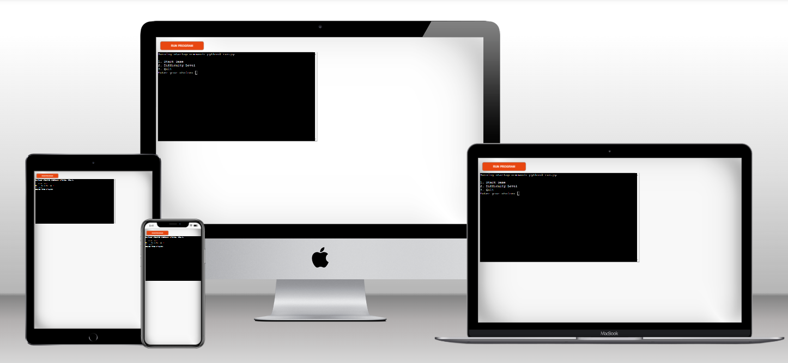
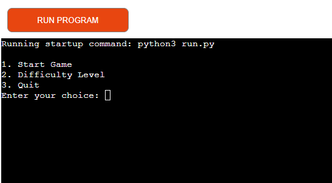
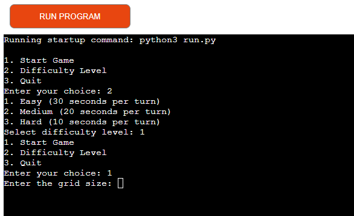
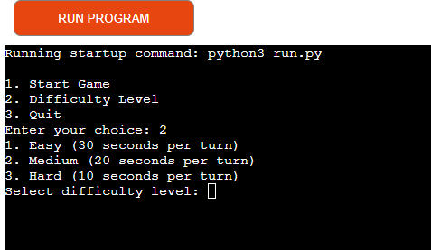
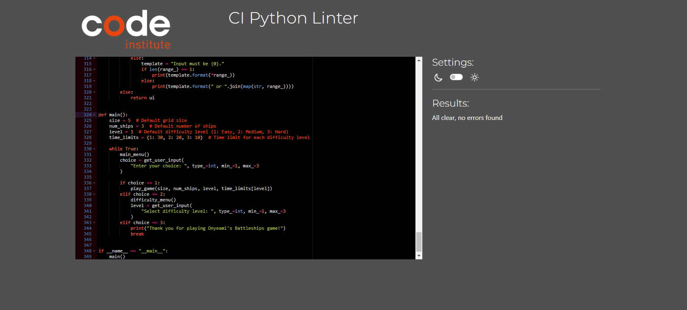

## **Welcome to Onyeami's Battleships game!**

Here is the live link - [Onyeami Battleships game](https://onyeami-battleships-a7717c6967d2.herokuapp.com/)

(Developer: Charles Onye)

## Introduction
This is Onyeami's Battleships Game. This is an exciting game of naval warfare, you will be the captain that will command and
strategically deploy your ships, and engage in thrilling battles on the high seas. Let's do it. This game is designed to be played 
on grids. It is a Python command-line project.

## Table of Contents
 - [Introduction](#introduction)
 - [Table of Contents](#table-of-contents)
 - [Project Objectives](#project-objectives)
 - [User Experience](#user-experience)
 - [Design](#design)
 - [Technologies](#technologies-used)
 - [Features](#features)
 - [Testing](#testing)
 - [Deployment](#deployment)

 ## Project Objectives
  The objective of Onyeami's Battleships game is to defeat your opponent by sinking all their ships before 
  they sink yours. The game is typically played on a grid. The specific objectives in the game are as follows:

 **Strategically Position Your Fleet**: Before the game begins, each player must position their ships on their grid without the opponent seeing.
   This step is crucial as it sets the stage for the entire game. Players must consider the size and shape of 
   their ships and deploy them in a way that makes them challenging for the opponent to locate and sink.

 **Take Turns to Attack**: Players take turns firing shots at the opponent's grid. The objective is to guess the coordinates where the 
   opponent's ships are located. If a shot lands on a square occupied by an enemy ship, it's a "hit." 
   If it lands in an empty square, it's a "miss."

 **Sink the Opponent's Ships**: The primary goal is to sink all of the opponent's ships. Ships are sunk when every square they occupy has been hit. 
   
 **Win the Game**: The first player to sink all of the opponent's ships wins the game. They are declared the victor, and the game concludes.
   
## User Experience
The core objective remains the same: strategically position your ships, take turns to attack your opponent's grid, and sink
their ships before they sink yours.

## User Story
1. ## _First Time Player_ 

- A first-time player would prefer to start with an easy-to-play game. Here, he has the opportunity to begin a new game and set up his ships.
  He will be prompted to either start the game or choose the desired difficulty level.

- A first-time player would appreciate clear game instructions. Here, the instructions are straightforward. If the player selects option 2 from the menu,
  he will have the option to play an easy, medium, or hard game. The waiting time varies depending on the chosen option.

- A first-time player will have the opportunity to become accustomed to the game. Here, he will have the privilege of playing the easy level, where the waiting
  time to select his coordinates is longer (30 seconds).

2. ## _Returning Player's Goals_

 - A returning will be aiming at perfecting in the game. He will definitely wants to play at least the medium, where he has 20 seconds or less to make a choice. His
   objective is to select a location on the opponent's grid and guess whether there is a ship in that position. If there is a ship, it's a hit. The returning player's goal is to hit and sink all of the opponent's ships.
   
 - The returning player at this stage will want to employ strategic thinking that helps maximize his chances of success. He must understand factors such as
   ship placement, patterns of play, and information gleaned from previous guesses (if any) to make educated guesses and ultimately sink the opponent's ships efficiently.

 - The returning player, just like the first-time player and the frequent player, will have the option to check the current game status while playing. The 
   game should then display information such as the number of hits, misses, and the remaining ships for both the player and his opponent.

3. ## _Frequent player Objectives_

 - The frequent player will definitely want to master the game's artistry and tackle the hard level, where he has only 10 seconds to choose he coordinates.
   He aims to sink the opponent's ships faster and win the game.

 - Regular players of Battleships game often strive to enhance their strategic thinking and predictive skills in order to become more effective at winning the game.

## Design

- The Onyeami Battleships game is a classic two-player strategy game where a player hides his fleet of ships on a grid and attempts to sink his opponent's fleet
  by guessing coordinates.

## Rules

- Players take turns, with one player going first.
- Players take turns choosing a coordinate on his opponent's grid to attack.
- if the attack hits a ship, the player is allowed to continue attacking until he misses.
- Players have the option to the difficult level to play.
- Players need to select option 2 in the start up menu in order to select the difficult level to play.
- From here, the players need to select either option 1 for easy level, option 2 for medium level and option 3 for hard level
- Players have 30 seconds waiting time to make a guess for the easy level, 20 seconds for medium level and 10 seconds for the hard level
- The first player to sink all of their opponent's ships wins the game.
- Click on RUN PROGRAM tab if you want to start a new game.

**Objectives**: The objective of the game is to sink all of your opponent's ships before they sink yours.

## Components
The game consists of:
- A grid on which each player places their ships and records their opponent's attacks.
- Ships: Each player has a fleet of ships.
- Coordinates: Players use coordinates to select the location they want to attack.
- Turn System: The game alternates between players, with each player taking one shot per turn
- Hit/Miss Indicators: The game provides feedback on whether an attack hit or missed a ship.

## Technologies Used

## Languages Used

- Python

## Frameworks, Libraries and Programs Used
1. Git
    - Git was used for version control by utilizing the Gitpod terminal to commit to Git and Push to GitHub.
2. GitHub:
    - GitHub is used to store the projects code after being pushed from Git.
3. Youtube:
   - Youtube was used for further researches and troubleshooting
4. Python:
   - The code was placed in the `run.py` file
4. Heroku App
   - Heroku account was created for the deployment of the project

## Features

 - Start the game:

On the menu page, the player is prompted to choose options  1 through 3.

Option 1 is to start the game, option 2 to select the difficult level, and option 3 is to quit.

After selecting option 2, you can choose the level you want to play: option 1 is to play the easy level,
option 2 is to play the medium level and option 3 is for the hard level.

## Testing
My file was validated using [Python Linter](https://pep8ci.herokuapp.com/).
There were no errors

Manual Testing were performed mainly

|   Test Case     |       Description      |          Steps                 |        Expected Results       | Pass/Fail |           Images                 |
| ----------------|------------------------|--------------------------------|-------------------------------|-----------|----------------------------------|
|1. New Game      | Verify that a new      |i. Run the main function.       | A new game starts, and        | Pass      |                                  |
|                 | game can be started.   |ii. Choose to start game        | the player's and computer's   |           |                                  |
|                 | started.               |iii. Enter Board Size           | grids are populated with      |           |                                  |
|                 |                        |iv. Enter Ships Size            | ships.                        |           |                                  |
|                 |                        |                                |                               |           |                                  |
|2. Game Board    | Verify that the        |i. Run the main function.       | The player's and              | Pass      |                                  |
|                 | game board is          |ii. Choose to start game.       | computer's grids are          |           |                                  |
|                 | populated randomly     |iii. Enter Board Size           | populated with ships          |           |                                  |
|                 | with ships.            |iv. Enter Ships Size            | at random locations.          |           |                                  |
|                 |                        |                                |                               |           |                                  | 
|3. Player's Ships| Verify that each       |i. Run the main function.       | The player and the            | Pass      |                                  |
|                 | player gets their      |ii. Choose to start game.       | computer each has their       |           |                                  |
|                 | own set of ships.      |iii. Enter Board Size           | own set of ships.             |           |                                  |
|                 |                        |iv. Enter Ships Size            |                               |           |                                  |
|                 |                        |                                |                               |           |                                  |
|4. Valid Guess   | Verify that a user     |i. Run the main function.       | The guess is treated as valid | Pass      |                                  |
|                 | can make a valid guess.|ii. Choose to start game.       |                               |           |                                  |
|                 |                        |iii. Make a valid guess         |                               |           |                                  |
|                 |                        |                                |                               |           |                                  |
|5. Invalid Guess | Verify that a          |i. Run the main function.       | Show an error message.        | Pass      |                                  |
|                 | program should show    |ii. Choose to start game.       |                               |           |                                  |
|                 | an error message       |iii. Make an invalid guess.     |                               |           |                                  |
|                 | for invalid guess.     |                                |                               |           |                                  |
|                 |                        |                                |                               |           |                                  |
|6. Correct Guess | Verify that a ship     |i. Run the man function.        | The ship is revealed if the   | Pass      |                                  |
|                 | can be sunk by         |ii. Choose to start game        | guess is a hit.               |           |                                  |
|                 | making a valid guess.  |iii. Make a guess that          |                               |           |                                  |  
|                 |                        |    hits a ship                 |                               |           |                                  |
|                 |                        |                                |                               |           |                                  |
|7. Sunk Ship     | Verify that the        |i. Run the main function.       | The game counts the           | Pass      |                                  |
|                 | game counts the        |ii. Choose to start game        | sunk ship towards the         |           |                                  |
|                 | sunk ship towards      |iii. Make a valid guess         | loss of the game.             |           |                                  |
|                 | the loss of the game.  |    that hits a ship.           |                               |           |                                  |
|                 |                        |                                |                               |           |                                  |
|8. Game End      | Verify that the        |i. Run the main function.       | The game ends when            | Pass      |                                  |
|                 | game ends when a       |ii. Choose to start game.       | the player loses all          |           |                                  |
|                 | player loses all       |iii. Make valid guesses that hit| their ships.                  |           |                                  |
|                 | their ships.           |                                |                               |           |                                  |
|                 |                        |                                |                               |           |                                  |
|9. Winner        | Verify that the        |i. Run the main function.       | The game ends when            | Pass      |                                  |
|                 | game ends when a       |ii. Choose to start game        | the player has sunk           |           |                                  |
|                 | player has sunk all    |iii. Make valid guesses         | all the other                 |           |                                  |
|                 | the ships of the       |   that hit all the other       | player's ships.               |           |                                  |
|                 | other player.          |   player's ships.              |                               |           |                                  |

## Deployment
git add:
- This command is used to stage changes for the next commit. Stage changes is a crucial step before committing codes to the Git repository.

git commit:
- The command is used to create a commit when changes are staged. A commit message using the '-m' flag to describe what the commit accomplishes.

git push:
- This command is used in Git to send the local changes to a remote repository, hosted on a GitHub remote server.

## Creating the Heroku app
- Sign up for Heroku's account at [Heroku's website](https://www.heroku.com)
- Select create new app from the dashboard, then go to the settings tab
- In settings tab, you will need to add two buildpacks. The ordering is as follows:
1. `heroku/python`
2. `heroku/nodejs`

You must then create a _Config Var_ called `PORT`. Set this to `8000`

Connect your GitHub repository and deploy as normal.

## Constraints

The deployment terminal is set to 80 columns by 24 rows. That means that each line of text needs to be 80 characters or less otherwise it will be wrapped onto a second line.

## Credits
Youtube and Google chrome were used extensively in this research
I have to give thanks to my mentor, Mr Narender for his valuable advise.